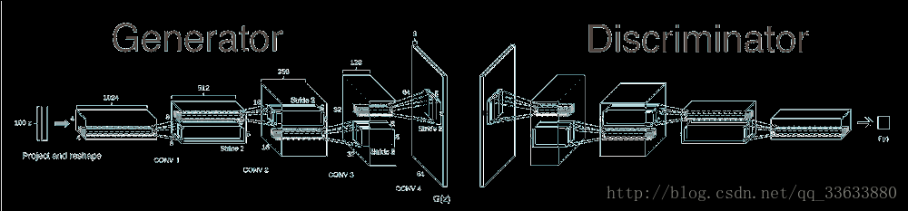
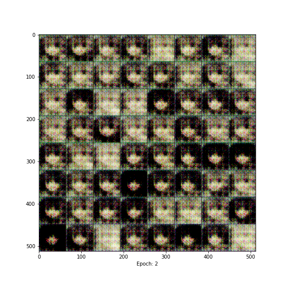
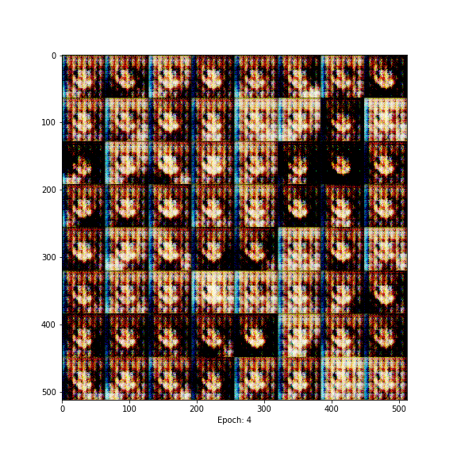
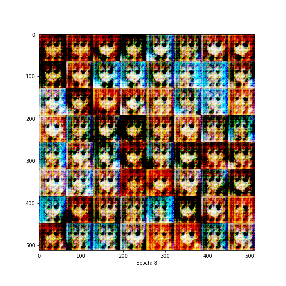
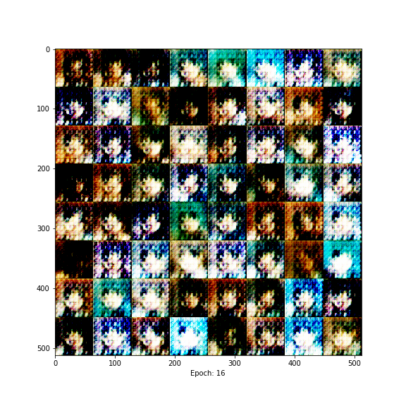
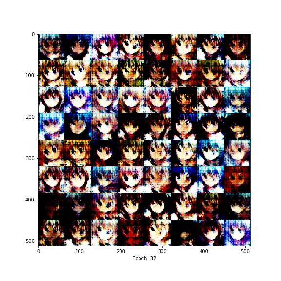
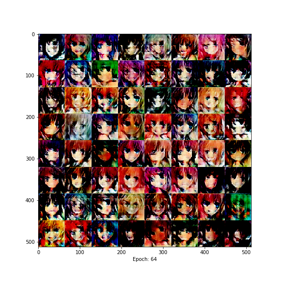
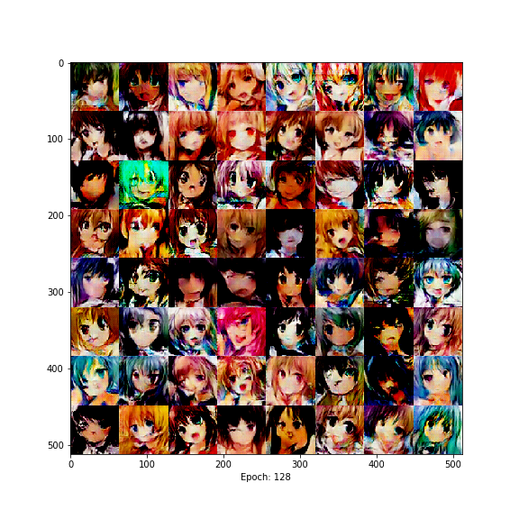
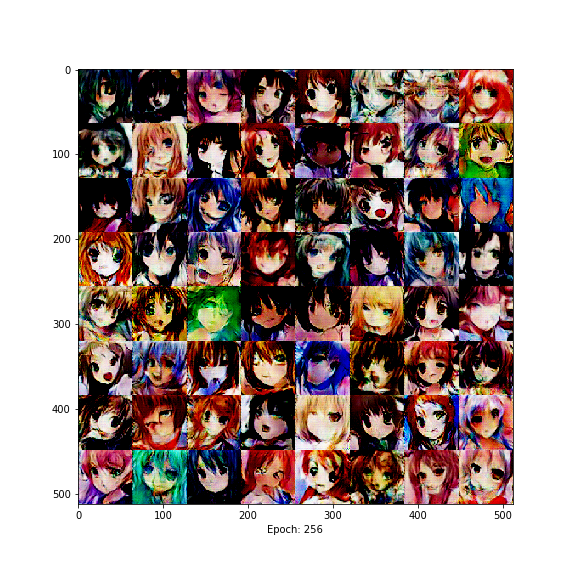
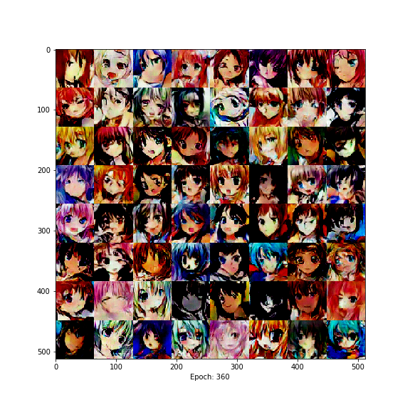

# DCGAN-Draw-Faces
深度卷积生成对抗网络（DCGAN）—— 动漫人脸生成 2018-10-22
## 更新至version8.py
## 请使用version7.py及其以上版本, version6.py及其以下有错误
## DCGAN结构：

## 训练集下载：
百度网盘： https://pan.baidu.com/share/link?shareid=4213798357&uk=706870674
提取码： g5qa
#### 将图片全部放入faces这个文件夹
##### faces
#####     ---...jpg
#####     ---...jpg
#####     ---...jpg
#####     ---...jpg
#####     -.......
## 训练推荐使用GPU，能为你带来100倍左右的提速
## 训练效果：
### epoch 1

### epoch 2

### epoch 4

### epoch 8

### epoch 16

### epoch 32

### epoch 64

### epoch 128

### epoch 256

### epoch 360

